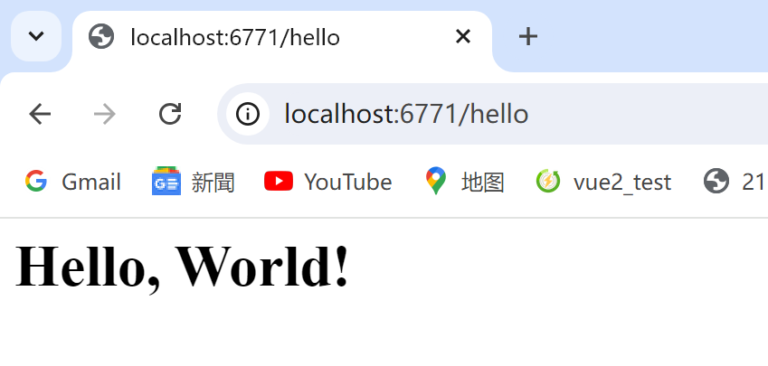

# Ter-WebServer
此项目是一个仿照Tomcat的web服务器、Servlet容器
## 使用
* 首先创建一个HttpServlet
```java
public class HelloServlet extends HttpServlet {
    @Override
    protected void doGet(HttpServletRequest req, HttpServletResponse resp) throws ServletException, IOException {
        resp.setContentType("text/html");
        resp.getWriter().println("<h1>Hello, World!</h1>");
    }
}
```
* 创建Ter实例对象，将创建的HttpServlet对象添加到容器当中，然后启动服务
```java
public class Main {
    public static void main(String[] args) throws LifecycleException{
        Ter ter = new Ter();
        ter.setPort(6771);
        Context ctx = ter.addContext("", null);
        ter.addServlet(ctx, "HelloServlet", new HelloServlet());
        ctx.addServletMappingDecoded("/hello", "HelloServlet");
        ter.start();
        ter.getServer().await();
    }
}
```
## 效果


